# [Architecture Review] Attention Is All You Need: The End of Sequential DNA - [Link to Paper : Attention IS All You Need](https://proceedings.neurips.cc/paper_files/paper/2017/file/3f5ee243547dee91fbd053c1c4a845aa-Paper.pdf)

- **Date**: 2026-03-16 (Start) - 2026-04-06 (Target)
- **Status**:
  - ✅ [2026-03-16] **Section I & III Complete**: Analysis of Section 1 Introduction, Section 2 Background, and Complexity ($O(n)$ vs $O(1)$ via Table 1).
  - ✅ [2026-03-18] **Section II (Part 1) Complete**: The Input Pipeline (Section 3.4 Embeddings & 3.5 Positional Encoding).
  - ✅ [2026-03-20]: **Section II (Part 2) Complete**: Core Architecture & Attention Mechanism (Section 3.1 Model Architecture & 3.2 Multi-Head Attention & 3.3 Point-wise Feed-Forward Networks).
  - ✅ [2026-03-24] **Section II & Section III Refinement**: Integrated Andrew Ng's Intuition on Q/K/V Database logic and Hardware-aware Efficiency.
  - 🎯 [2026-03-25 ~ 04-06 Target] **Section III, IV, V & Final Synthesis**: Optimization, Results, and Strategic Domain Adaptation. (Section 4, Section 5, Section 6, Section7)
    - ✅ [2026-03-25]: Update Section III (Complexity Analysis - Section 4 Why Self-Attention Deep-Dive).
    - ✅ [2026-04-06]: Update Section IV (Systematic Evaluation - Section 5 Training & Stability Logic).
    - ✅ [2026-04-06]: Update Section V (Final Verdict - Section 6 Results & Section 7 Conclusion).
    - 📅 [2026-04-06]: Update Section IV (Systematic Evaluation - Strategic Domain Adaptation for Chip Design).
    - 📅 [2026-04-06]: Update Section V (Final Verdict - Hardware-Aware Quantization & Technical Proposal).
- **Goal**: Deconstruct the Transformer architecture and establish a Hardware-Aware Technical Proposal for Semiconductor Design Automation.

---

## I. The Motivation: Why RNNs Must Die (Section 1 & Section 2)

### **The Sequential Bottleneck** (Section 1 Introduction)

- *"**Sequential nature precludes parallelization** within training examples, which becomes critical at longer sequence lengths, as memory constraints limit batching across examples."*

- **Architect's View** : The core limitation of RNN architecture is their sequential nature over time. The GRU and LSTM have been established as state-of-the-art approaches but the fundamental constraint of sequential computation remains. The sequential chain ($a^{\langle t \rangle} = f(a^{\langle t-1 \rangle}, x^{\langle t \rangle})$) creates an optimization bottleneck (Vanishing Gradient) and a computational bottleneck ($O(n)$ serial execution). Other approaches like Bidirectional RNN and Deep RNN require 2x computation costs and 100% latency or double vanishing issue which make it unsuitable for real-time monitoring and inefficient for scaling. Modern GPUs are built for SIMD (Single Instruction, Multiple Data) but this limitation forces serial execution so that low utilization is inevitable. And if sequence is getting longer and longer, the bottleneck of memory bandwidth is getting critical since it should send/receive a bunch of hidden state due to $O(n)$ dependency. It definitely degrades latency and performance of system.

### **The Distance Problem** (Section 2 Background)

- *"The goal of reducing sequential computation also forms the foundation of the Extended Neural GPU, **ByteNet** and **ConvS2S**, all of which use **convolutional neural networks** as basic building block, computing hidden representations in parallel for all input and output positions. In these models, the number of operations required to relate signals from two arbitrary input or output positions **grows in the distance between positions**, **linearly for ConvS2S and logarithmically for ByteNet**. This makes it more difficult to learn dependencies between distant positions."*

### **The $O(1)$ Revolution** (Section 2 Background)

- *"In the Transformer this is reduced to a constant number of operations, albeit at the cost of reduced effective resolution due to averaging attention-weighted positions, an effect we counteract with Multi-Head Attention as described in section 3.2."*

- **Architect's View** : This paper states **Transformer** can reduce the number of operations to a **constant number** unlike legacy models where complexity grows with distance between positions. It can solve the core limitation of RNN architecture which is sequential computation so that optimization and computation bottleneck can be resolved correspondingly. And it would be helpful for the bottleneck of memory bandwidth dramatically. In Table 1 in paper, this innovation is quantized as **Maximum Path Length ($O(1)$)**. It means all information is connected by single-step regardless of length of sequence. This is core theory to destroy dependency of RNN on $O(n)$.

---

## II. The Engine: Transformer Core Architecture (Section 3 Model Architecture)

### **The Input Pipeline: The Materials (Material Preparation)** (Section 3.4 & Section 3.5)

#### **Embeddings (Creating Semantic Coordinates)** (Section 3.4 Embedding and Softmax)

- *"In our model, we use **learned embeddings** to convert the input tokens and output tokens to **vectors of dimension $d_{model}$**."*
- *"In the embedding layers, we multiply those **weights by $\sqrt{d_{model}}$**.​"*

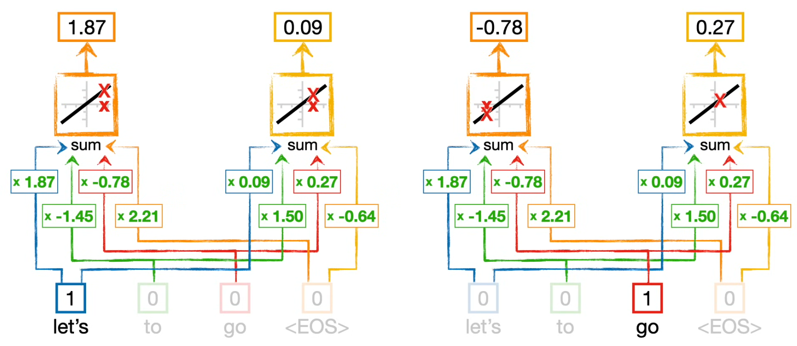

**[Figure 1: Word Embedding ($E$) (Input) - Expanded]**

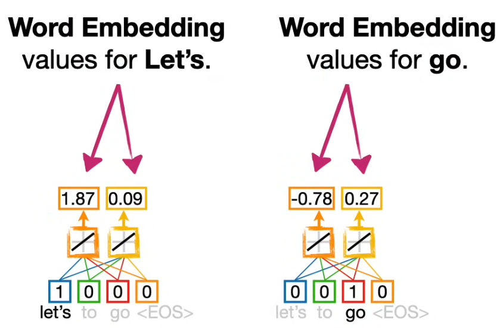

**[Figure 2: Word Embedding ($E$) (Input) - Consolidated]**

- **Mechanism**:
  - **Embedding**: Learned embeddings is used to convert input tokens and output tokens to **vectors of dimension $d_{model}$** to have Semantic Density.
  - **Transformation & Softmax**: The embedded vector is multiplied by a massive weight matrix W, transforming it onto a high-dimensional space matching the full vocabulary size. The Softmax normalizes all scores into a range between 0 and 1, ensuring the total sum equals exactly 1.0.
    With Transformation and Softmax, the system can get predicted next-token probabilities.
  - **Weights Sharing**: The Same Weight Matrix is shared between input and output embedding layers for efficiency **since only difference of these two layers is direction** so should share context map.
  - **Scaling Weights**: The Weight Matrix for input and output embedding layers is multiplied by **$\sqrt{d_{model}}$**.

- **Architect's View**:
  - **From Tokens to Tensors**: The **Embeddings** not merely a simple substitution, but a process of mapping discrete data into a **Continuous Vector Space** containing Semantic Density for relation between tokens. This serves as the foundation for creating the **Coordinates of Knowledge** in the RAG system.
  - **The Bridge to Human Language**: The **Transformation & Softmax** is a **Digital-to-Analog** converter that maps the abstract vector space back into a discrete word space. It is a process of asking, **'How closely does this abstract meaning ($d_{model}$) resemble each word in our vocabulary ($V$)?'** This is the moment where 'Logits' are assigned to each word and the final stage of the Engineering Determinism. It converts abstract signals into a probabilistic certainty.
  - **Efficiency Logic**: The **Sharing Weights** can maximize **memory efficiency** by reducing number of parameters. This eliminates the need for redundant storage so slashes memory bandwidth in half. From the perspective of the hardware accelerator, this is a masterstroke that drastically reduces VRAM consumption.
  - **Numerical Governance**: Multiplying the embedding weights by $\sqrt{d_{model}}$ is not mere arithmetic; it is a form of Numerical Governance for **Engineering Determinism** designed to **prevent loss of context** and **maintain the discriminative power of Softmax** in high-dimensional spaces.
    - **Signal-to-Noise Ratio(SNR) Control**: In the Transformer architecture, embeddings ($E$) and positional information ($PE$) are combined through summation ($E + PE$). Learned embeddings often maintain very small magnitudes depending on their initialization. If the embedding values are too minute, the original 'semantic meaning' of the word is drowned out by the 'noise' of the positional information the moment they are merged. By scaling the embeddings by $\sqrt{d_{model}}$, it adequately amplify the vector magnitude. This ensures the word's inherent meaning remains distinct and robust even after being integrated with positional data.
    - **Gradient Preservation**: As the vector dimension ($d_{model}$) increases, the dot-product values of embedding vectors tend to grow exponentially and the variance of the dot-product between two vectors grows in proportion to $d_{model}$. Excessive dot-product magnitudes cause the Softmax function to saturate, driving outputs to extreme values of 0 or 1. This leads to Gradient Vanishing, where the derivative approaches zero, effectively halting the learning process. Dividing by or pre-multiplying by $\sqrt{d_{model}}$ acts as a 'mathematical damper' that normalizes this variance to 1, ensuring the Softmax input remains within the 'Active Region' for effective learning.
        Pre-scaling the embeddings in Section 3.4 is a preemptive measure to control potential 'numerical explosion' during the Attention operations (Section 3.2.1).

#### **Positional Encoding (Injecting Temporal DNA)** (Section 3.5 Positional Encoding)

- *"Since our model contains no recurrence and no convolution, in order for the model to make use of the order of the sequence, we must **inject some information about the relative or absolute position** of the tokens in the sequence."*
- *"We chose the **sinusoidal version** because it may allow the model to **extrapolate** to sequence lengths longer than those encountered during training."*

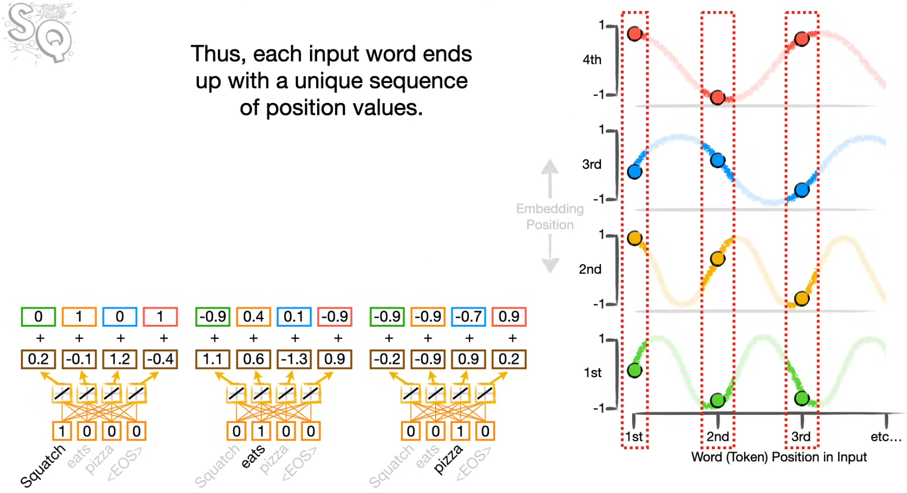

**[Figure 3: Positional Encoding ($PE$) Calculation]**

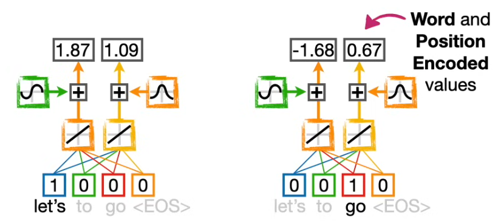

**[Figure 4: Word Embedding ($E$) + Positional Encoding ($PE$)]**

- **Mechanism - The "Mathematical Clock" System**:
  - **Mathematical Timestamp**: Because Transformers process all tokens simultaneously (Parallelism), they lack a natural sense of "time." Positional Encoding acts as a **"Digital Seat Ticket,"** assigning a unique mathematical coordinate to every token so the model knows "who sits where."
  - **The Sinusoidal Formula**: Each word is equipped with 512 different "clocks" (dimensions). The clocks at the beginning spin fast (high frequency), while those at the end spin slowly (low frequency). This creates a **Unique Fingerprint** for every position:
        $$PE_{(pos, 2i)} = \sin\left(\frac{pos}{10000^{2i/d_{model}}}\right)$$
        $$PE_{(pos, 2i+1)} = \cos\left(\frac{pos}{10000^{2i/d_{model}}}\right)$$
  - **Linear Relationship**: Using Sine and Cosine allows the model to calculate the distance between words easily. For any fixed offset $k$, $PE_{pos+k}$ can be represented as a **linear function** of $PE_{pos}$. It’s like knowing that "15 minutes later" is always a $90^\circ$ turn on the clock face, no matter what time it is now.
  - **Extrapolation Capability**: Unlike learned positions, this functional approach allows the model to **"calculate"** the position of the 1,001st word even if it was only trained on 500 words. It follows the continuous wave pattern.

- **Architect's View**:
  - **Time without a Clock**: In RNNs, time was a physical bottleneck ($O(n)$). In Transformers, time is treated as a **Spatial Coordinate**. We provide a "Compass of Time" so the system can perform SIMD (Single Instruction, Multiple Data) operations across the entire sequence while still respecting the **"Sequential DNA"** of the data.
  - **The End of Recurrence ($O(1)$ Revolution)**: By *calculating* position instead of *waiting* for it, we transform temporal dependency into a constant-time mathematical addition. This is the ultimate **"Architectural Bypass"** for hardware scaling on GPUs.
  - **Information Fusion ($E + PE$)**: We "layer" these positional waves on top of the semantic embeddings. This is a high-efficiency technique that keeps the data compact for memory bandwidth.
  - **The Necessity of Scaling**: To ensure the "Time Stamp" ($PE$) doesn't drown out the "Word Meaning" ($E$), we rely on the **Numerical Governance** established in Section 3.4 (scaling by $\sqrt{d_{model}}$). This keeps the semantic signal robust even after the temporal DNA is injected.

### **The Processing Core: System Assembly & Intelligence** (Section 3.1 & 3.2 & 3.3)

- *"Most competitive neural sequence transduction models have an **encoder-decoder structure**"*
- *"The Transformer follows this overall architecture using **stacked self-attention** and **point-wise, fully connected layers** for both the encoder and decoder"*

#### **The Intelligence Engine: The Eyes** (Section 3.2.1 Scaled Dot-Product Attention & Section 3.2.2 Multi-Head Attention)

##### **Scaled Dot-Product Attention** (Section 3.2.1 Scaled Dot-Product Attention)

- *"An attention function can be described as mapping a **query and a set of key-value pairs** to an output."*

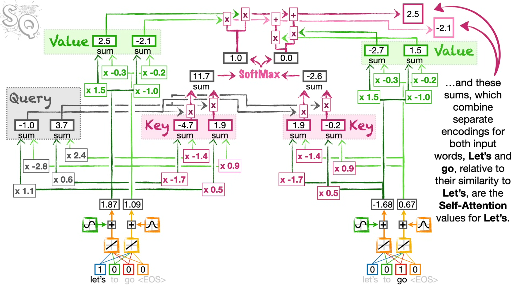

**[Figure 5: Scaled Dot-Product Attention (Self-Attention)]**

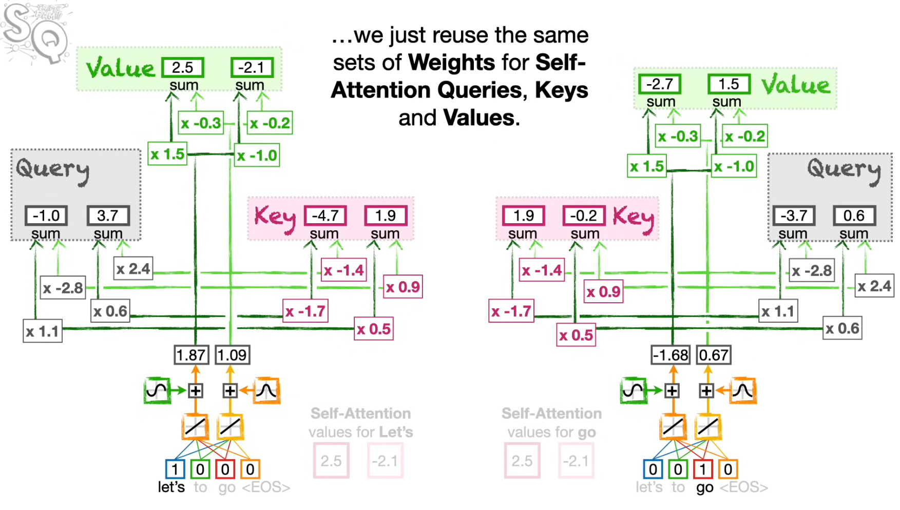

**[Figure 6: Scaled Dot-Product Attention for Multiple Tokens (Self-Attention) & Reuse Weight for Q, K, V]**

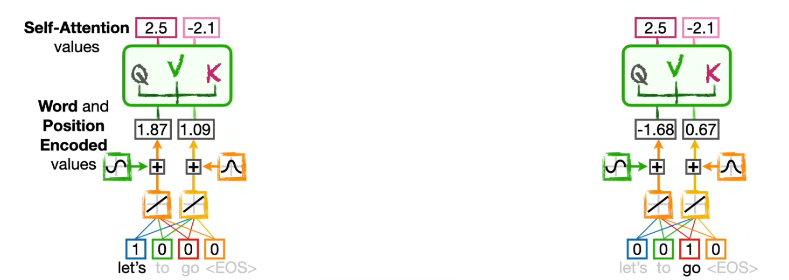

**[Figure 7: Scaled Dot-Product Attention (Self-Attention) - Consolidated]**

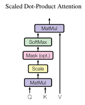

**[Figure 8: Scaled Dot-Product Attention (Self-Attention) - Detail]**

- **The Taxonomy of Attention: Defining the Terms**
  - **Scaled Dot-Product Attention (The 'How')**: The mathematical engine. It uses matrix multiplication (Dot-product) and scaling to compute relations. It is designed for **maximum SIMD (Single Instruction, Multiple Data) efficiency**.
  - **Self-Attention (The 'Scope')**: A specific application of the engine where **Queries($Q$), Keys($K$), and Values($V$) all originate from the same source**. It allows the model to perform "internal brainstorming" to understand how different parts of a single sequence relate to each other.
  - **Legacy Attention (The 'Old Way')**: RNN-based attention (e.g., Bahdanau) used an **Additive** approach with a small neural network to compute scores. It was a sequential bottleneck—slow and impossible to parallelize across the entire sequence at once.

- **Mechanism**:
  - **Roles**: $Q(Query)$ is the search intent, $K(Key)$ is the index of information, and $V(Value)$ is the actual content.
  - **The Calculation**: We compute the dot product of $Q$ and $K$, scale it by $\sqrt{d_k}$, and apply Softmax to get the weights for $V$.
    $$\text{Attention}(Q, K, V) = \text{softmax}\left(\frac{QK^T}{\sqrt{d_k}}\right)V$$
  - **Variance Damper ($\sqrt{d_k}$)**: As $d_k$ increases, the magnitude of the dot product grows, pushing the Softmax function into regions with extremely small gradients. Dividing by $\sqrt{d_k}$ maintains numerical stability—a crucial form of **Numerical Governance** to prevent Gradient Vanishing.

- **[Deep-Dive] The Intelligent Library Analogy ($Q, K, V$ Generation)**:
  - **Query ($Q$) - "The Search Term"**: What is the current token looking for? It represents the intent to find specific context from other tokens.
  - **Key ($K$) - "The Book Label"**: What information does this token offer? It acts as the index/tag that other tokens use to determine relevance.
  - **Value ($V$) - "The Book Content"**: What is the actual substance? Once relevance is confirmed via $Q$ and $K$, $V$ is the information actually retrieved.
  - **The Projection Logic**: We don't use the input $X$ directly because a word (e.g., "Bank") may have different **Search Intent (Q)** and **Offered Info (K)** depending on the context. $W^Q, W^K, W^V$ allow the model to dynamically separate these roles.

- **Architect's View**:
  - **Intelligent Piping (Q, K, V)**:
        This is the blueprint for **Agentic Orchestration**. $Q$ maps to the **Agent's Intent**, $K$ to the **Knowledge/Tool Index**, and $V$ to the **Actual Data/Manuals**. By calculating the relationship between all tokens simultaneously, the system establishes a global context map in a single step.
  - **The End of Recurrence ($O(1)$ Revolution)**:
    - **Reuse Weights ($W^Q, W^K, W^V$)**:
            Unlike RNNs that require new parameters for every time step, the Transformer reuses the **same set of weights ($W^Q, W^K, W^V$)** for every token for calculating Queries($Q$), Keys($K$) and Values($V$). This ensures architectural consistency and massive scalability - no matter the sequence length, the "Intelligence Logic" remains constant.
    - **The Death of Sequential DNA**:
            In Legacy Attention, you had to wait for the previous token's hidden state. In Scaled Dot-Product Attention, **all $Q, K, and V$ are calculated in parallel**. This transforms the $O(n)$ sequential bottleneck into an $O(1)$ parallel operation, fully saturating GPU compute cores and slashing latency.

##### **Multi-Head Attention** (Section 3.2.2 Multi-Head Attention)

- *"Multi-head attention allows the model to jointly attend to information from **different representation subspaces**."*

**[Figure 9: Multi-Head Attention - Simple]**

**[Figure 10: Multi-Head Attention - Detail]**

- **Mechanism**:
  - **Dimensional Splitting ($d_{model} \to d_k \times h$)**: Instead of performing a single attention function with the full $d_{model}(512)$, the Transformer employs $h=8$ parallel heads. Each head operates on a reduced dimension of $d_k = d_v = d_{model}/h = 64$. This allows the model to maintain the same computational cost as single-head attention while increasing the diversity of its focus.
  - **Representation Subspaces**: Each head has its own set of learnable weights ($W^Q_i, W^K_i, W^V_i$). This enables the model to simultaneously focus on different aspects of the input sequence. For example, one head might specialize in **syntactic dependencies**, while another captures **long-range semantic relationships**.
  - **Concatenation & Final Projection ($W^O$)**: After the 8 heads calculate their attention independently, the outputs are concatenated and projected back into the original $d_{model}$ space through a final weight matrix $W^O$. This "merges" the 8 different perspectives into a single, high-fidelity representation.
    $$\text{MultiHead}(Q, K, V) = \text{Concat}(\text{head}_1, ..., \text{head}_h)W^O$$
    $$\text{where head}_i = \text{Attention}(QW^Q_i, KW^K_i, VW^V_i)$$
- **Architect's View**:
  - **Intelligent Piping: Multi-Channel Orchestration**:
        If Scaled Dot-Product Attention is a single pipe, Multi-Head Attention is a **Parallel Pipeline** that routes specific types of information to the right reasoning step. By having 8 sets of weights ($W^Q, W^K, W^V$), we can capture 8 different types of relationships among tokens. This is critical for establishing context in complicated sentences where a single "viewpoint" would lead to the loss of nuanced information.
  - **Parallel Sensory Filters (The Multi-Eye Metaphor)**:
        This is the **"Multi-Dimensional Radar"** of our system. In **Agentic AI**, one head acts as a sensor for **Technical Constraints** (e.g., API schemas, token limits), while another head monitors **Contextual Nuance** (e.g., user intent, business goals).
        By filtering the same data through 8 different "specialist eyes" simultaneously, the model avoids the "averaging effect" of a single-head system. It achieves **Deterministic Intelligence** by ensuring that critical details(like a specific constraint) are not drowned out by general context, allowing the agent to 'see' the technical floorplan and the user's aesthetic preferences at the same time.

#### **The Infrastructure: Stabilization & Bypass (Residual & LayerNorm)** (Section 3.1 Encoder and Decoder Stacks)

- *"We employ a **residual connection** around each of the two sub-layers, followed by **layer normalization**."*
- *"Output of each sub-layer is $\text{LayerNorm}(x + \text{Sublayer}(x))$."*

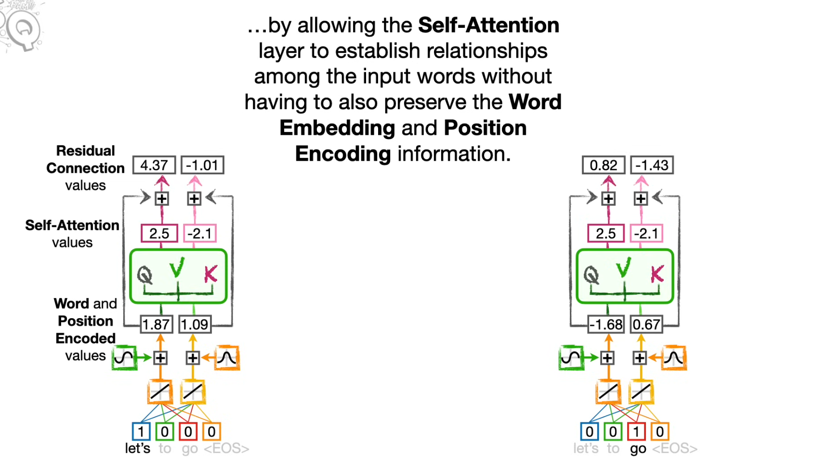

**[Figure 11: Residual Connection]**

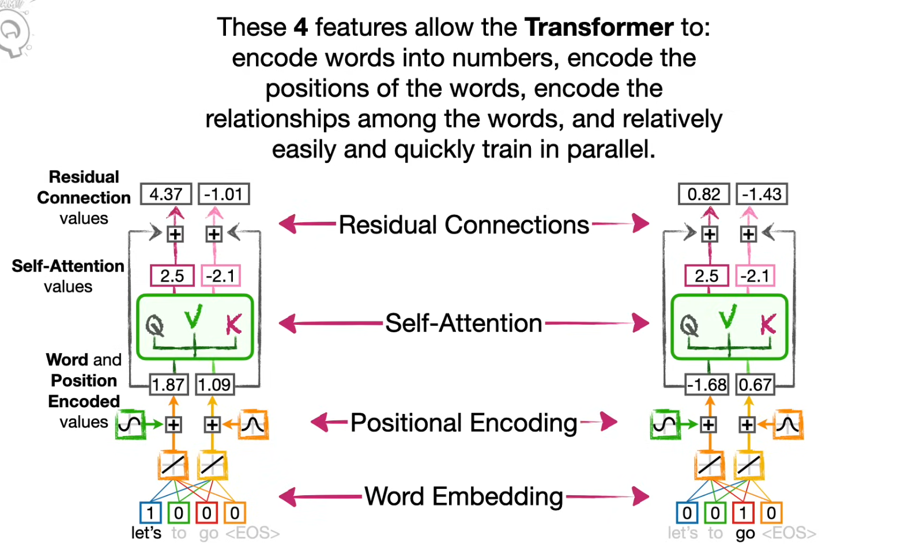

**[Figure 12: Word Embedding + Positional Encoding + Self-Attention + Residual Connection]**

- **Mechanism: The Add & Norm Unit**:
  - **Residual Connection (The Highway System)**:
        Implemented as $x + \text{f}(x)$, where $\text{f}(x)$ is the output of the sub-layer. It is the "Superpower" that actually allows us to build deep networks. Without this, the Transformer would just be a shallow, weak model.
    - **The Mathematical Escape: Preventing Vanishing Gradients**: In traditional deep networks, layers are stacked sequentially ($y = f(g(h(x)))$). During Backpropagation, gradients are multiplied across layers. If these gradients are even slightly less than 1, they shrink exponentially (**Vanishing Gradient**), making it impossible to train deep stacks like $N=6$.
      - **The Formula**: $$y = x + f(x)$$
      - **The Calculus (The "Hero" Logic)**: When we take the derivative of the output with respect to the input, it becomes $$\frac{dy}{dx} = \frac{d}{dx}(x + f(x)) = 1 + f'(x)$$
      - **The Result**: The **"$1$"** acts as a mathematical guarantor. Even if the complex sub-layer $f(x)$ produces a near-zero gradient, the total gradient remains at least $1$. This ensures the learning signal "teleports" back to the earlier layers without losing strength.
    - **Identity Mapping: The Architectural Safety Net**: Mathematically, it is significantly easier for a neural network to learn "nothing" (an identity map) than to perfectly reconstruct an input.
      - **The Safety Mechanism**: If a specific layer is not contributing to the task, the model can simply learn to set the weights in $f(x)$ to zero.
      - **The Survival**: Because of the connection ($x + 0$), the signal $x$ survives unchanged. This gives the architecture a **"Safety Net,"** allowing us to stack many layers without the risk of the model's performance degrading.
  - **Layer Normalization (The Voltage Regulator)**:
        It re-centers and re-scales the activations for each position independently.
        $$y = \frac{x - \text{E}[x]}{\sqrt{\text{Var}[x] + \epsilon}} \cdot \gamma + \beta$$
    - $\gamma, \beta$: Learnable parameters that allow the model to re-scale/re-shift the normalized signal if necessary.
    - $\epsilon$: A small constant to prevent division by zero.
    - **Stabilization**: By forcing a mean of $0$ and a variance of $1$, it keeps the internal signals within the **"Active Region"** of the model, preventing numerical explosion (Exploding Gradient) or decay (Vanishing Gradient).

- **Architect's View**:
  - **Numerical Resilience (Intent Insurance)**:
        In **Agentic AI** orchestration, the **Original User Intent ($x$)** must travel through a long reasoning chain. This highway acts as **Intent Insurance**, ensuring the core mission is mathematically preserved and not distorted by the "internal noise" or complex computations of the Attention or FFN layers.
  - **Stability for Scale (The Voltage Regulator)**:
        Just as electronic components burn out with excessive voltage or fail to trigger with insufficient power, neural signals can **Explode** (becoming too large) or **Vanish** (becoming too small) during deep processing. Scaling an Agentic system requires the integration of diverse and often "noisy" data sources — ranging from RAG-retrieved documents and API outputs to unpredictable human prompts. **Layer Normalization** acts as the ultimate **Standardizer** in this heterogeneous environment. By enforcing **Numerical Governance** (Mean 0, Var 1) at every sub-layer, it prevents "Internal Covariate Shift" where fluctuating data scales could paralyze the learning process. This stability is the prerequisite for **Scale**; it allows the engine to ingest varied inputs from multiple external tools while maintaining a steady, predictable state of equilibrium across the entire architecture.

#### **The Muscle of Processing: Position-wise FFN** (Section 3.3 Point-wise Feed-Forward Networks)

- *"Each of the layers contains a **fully connected feed-forward network**, which is applied to each position separately and identically."*
- *"This consists of **two linear transformations with a ReLU activation** in between."*

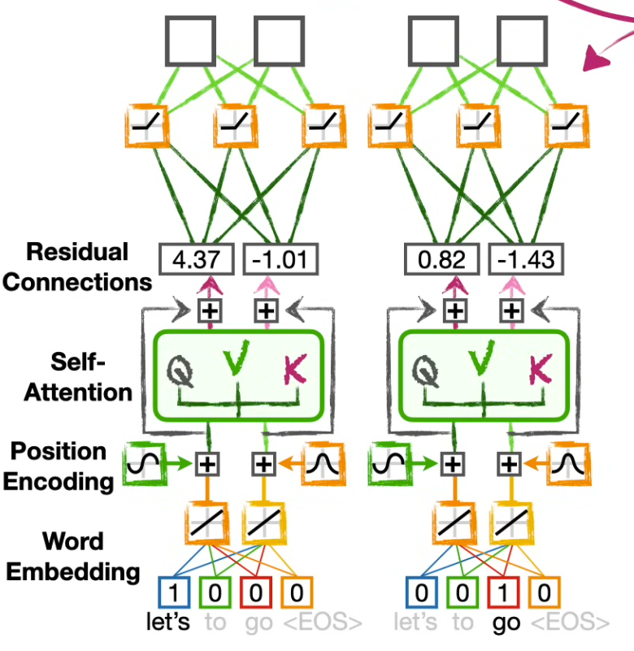

**[Figure 13: Position-wise FFN]**

- **Mechanism**:
  - **Position-wise Processing**: Unlike the Attention mechanism which focuses on the "Relationships" between tokens, the FFN operates on **each token position independently**. There is no cross-token communication here — only deep, localized computation for each individual signal.
  - **Dimensional Expansion & Contraction**: The network projects the input $d_{model}=512$ into a much larger latent space $d_{ff}=2048$, then projects it back to the original $d_{model}=512$.
    - **The Formula**:
        $$\text{FFN}(x) = \max(0, xW_1 + b_1)W_2 + b_2$$
  - **ReLU Activation**: The 4x expansion followed by a ReLU non-linearity allows the model to learn complex, non-linear features that a simple linear mapping could never capture.

- **[Deep-Dive] The "Deep Work" Analogy**:
  - **Attention is the "Team Meeting"**: Tokens communicate, exchange context, and decide which information is relevant.
  - **FFN is "Individual Deep Work"**: After the meeting, each token goes back to its own "desk" (position-wise) to process the gathered information. It uses its internal parameters (learned weights) to refine its own representation without external distractions.
  - **Dimensional Expansion**: The 4x expansion ($512 \to 2048$) is like spreading out all the gathered notes on a massive desk to identify hidden connections before summarizing the final result back into a compact report.

- **Architect's View**:
  - **The Specialized Execution Unit**:
        In **Agentic AI**, if Attention is the "Orchestrator" that routes information, the FFN is the **"Worker"** that executes specific logic. Because each position is processed identically and independently, it maximizes **GPU SIMD (Single Instruction, Multiple Data) Throughput**. This is where the raw "Compute Muscle" resides, enabling the system to handle massive, high-speed workloads.
  - **The Knowledge Storage Layer (The Hard Drive)**:
        While Attention handles "Dynamic Context," the FFN stores **"Static Knowledge."** The vast majority of the Transformer's trainable parameters are located here. It functions as the model's **Long-term Memory**, where factual patterns and world knowledge are physically encoded in the weights $W_1$ and $W_2$.
  - **Non-linear Reasoning Power**:
        The expansion to $d_{ff}=2048$ provides the **"Mathematical Volume"** necessary for the model to separate and organize complex, non-linear features. Without this "Muscle," the agent could "see" the context (Attention) but would lack the "Brain Power" to process and reason through it effectively.

- **Architect's Deep-Dive - Hardware-Aware Design (Why Transformers Dominate GPUs)**:
    While the Attention mechanism provides the "Intelligence," the specific design of the **FFN ($512 \to 2048 \to 512$)** is what allows the Transformer to achieve the **Theoretical Optimum** in hardware throughput.
  - **Maximizing GPU SIMD Utilization**:
    - **The RNN Bottleneck**: Recurrent models ($O(n)$) force the GPU to process one token at a time, leaving ~90% of the thousands of CUDA cores idle (Waiting for $t-1$).
    - **The FFN Solution**: Because FFN is **Position-wise**, 1,000 tokens can be processed by 1,000 independent threads simultaneously. This fully saturates the **SIMD (Single Instruction, Multiple Data)** architecture of modern GPUs, transforming a sequential bottleneck into a parallel superhighway.
  - **Arithmetic Intensity (The $4 \times d_{model}$ Logic)**:
    - **Memory vs. Compute**: In modern hardware, the cost of moving data (Memory I/O) is much higher than the cost of calculating it.
    - **The Strategy**: Expanding the dimension to $2048$ increases the **Arithmetic Intensity**. It gives the GPU "more work to do" on the data it has already loaded into the fast L1/L2 caches. This 4x expansion ensures the compute units are at 100% utilization, making the most of every memory-load cycle.
  - **Weight Reuse & Cache Locality**:
    - **Efficiency**: Unlike models that require unique parameters per step, the Transformer reuses the **exact same weight matrices ($W_1, W_2$)** for every single token in the sequence.
    - **The Result**: The weights can be pinned in the **High-speed GPU Cache**, drastically reducing the need to fetch data from the slower VRAM. This minimizes memory bandwidth pressure—the #1 bottleneck in large-scale AI orchestration.
  - **GEMM & Tensor Core Optimization**:
    - **Hardware-Friendly Math**: Almost all operations in Section 3.3 are **GEMM (General Matrix Multiply)**.
    - **The Alignment**: Dimensions like $512$ and $2048$ are powers of 2 (specifically multiples of 8 and 16), which are perfectly aligned with NVIDIA’s **Tensor Cores**. This alignment allows the hardware to perform $16 \times 16$ matrix math in a single clock cycle, achieving nearly $2\times$ to $5\times$ speedups compared to non-aligned architectures.
  - **Numerical Governance for Quantization (FP16/INT8)**:
    - **The Throughput Hack**: By using **LayerNorm** and **Scaling ($\sqrt{d_k}$)** to keep activations within a predictable range (Mean 0, Var 1), the architecture becomes "Quantization-Ready."
    - **High-Speed Execution**: This stability allows us to use **FP16 (Half-Precision)** or **INT8** training/inference with minimal loss in accuracy. Since FP16 is twice as fast as FP32 on most GPUs, the "Numerical Governance" we established is actually a direct driver for **200% higher throughput**.

#### **System Assembly & Cross-Communication** (Section 3.1 Encoder and Decoder Stacks & Section 3.2.3 Applications of Attention in our Model)

- *"The encoder is composed of a stack of $N=6$ identical layers. . . The decoder is also composed of a stack of $N=6$ identical layers. In addition to the two sub-layers in each encoder layer, the decoder inserts a **third sub-layer**, which performs multi-head attention over the output of the encoder stack."*
- *"We also modify the self-attention sub-layer in the decoder stack to prevent positions from attending to subsequent positions."*

**[Figure 14: The Transformer Architecture - Simple]**

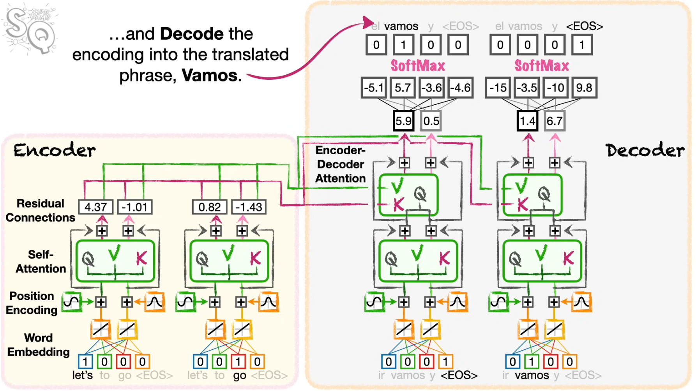

**[Figure 15: The Transformer Architecture - Detail (Position-wise FFN is omitted)]**

- **Mechanism**:
  - **Stacked Intelligence ($N=6$)**: The system is built on a stack of 6 identical layers to achieve **Hierarchical Refinement**.
    - **Abstraction Levels**: With each successive layer, data evolves from a mere string of words into **high-dimensional contextual representations**.
      - **The Lower Layers(Layer 1-2)** captures **Surface Features**, including syntactic relations and local dependencies between tokens
      - **The Middle Layers(Layer 3~4)** establishes **Semantic Context** through intra-sentence relationships and pronoun resolution.
      - **The Higher Layers(Layer 5~6)** constructs **High-level Abstract Concepts**, including the global intent of the sentence and dependencies among intricate technical constraints.
    - **Hierarchical Processing**: Instead of processing information in a single pass, it undergoes **Hierarchical Refinement** through successive layers. Granular features extracted at lower layers are synthesized into higher-level logical constructs as they propagate upward through the network.
  - **Component Breakdown: Encoder vs. Decoder Roles**:
    - **The Encoder (The Contextualizer)**:
      - **Goal**: Transform raw input into a rich, bidirectional context map.
      - **Structure**: 2 Sub-layers per stack.
                1. **Multi-Head Self-Attention**: To see the whole sentence at once and understand "who is doing what."
                2. **Position-wise FFN**: To process and store the learned features of each token.
        - **Residual connection** is employed around each of the sub-layers, followed by **Layer Normalization**
      - **Characteristic**: No masking. It has **Full Visibility** to capture the global context from the start.
    - **The Decoder (The Generator & Executor)**:
      - **Goal**: Generate tokens one by one while grounding them in the Encoder's knowledge.
      - **Structure**: 3 Sub-layers per stack (The "Extra Layer" Logic).
                1. **Masked Multi-Head Self-Attention**: To maintain **Causality** (prevents looking at the future).
                2. **Encoder-Decoder Attention**: The **"Retrieval Layer"** that pulls relevant info from the Encoder.
                3. **Position-wise FFN**: To refine the retrieved info into a final output prediction.
        - **Residual connection** is employed around each of the sub-layers, followed by **Layer Normalization**
      - **Characteristic**: **Temporal Constraint**. It operates under a strict "past-to-future" flow.
  - **Applications of Attention (Three-Way Routing)**: (Section 3.2.3)
        1.  **Encoder Multi-Head Self-Attention**: $Q, K, V$ all originate from the previous encoder layer. This allows each position in the encoder to attend to all other positions, creating a holistic context map of the input.
        2.  **Decoder Multi-Head Masked Self-Attention**: Similar to the encoder, but with **Masking** applied. It restricts each position to only attend to previous positions, preserving temporal order.
        3.  **Encoder-Decoder Attention (The Bridge)**: The Queries ($Q$) come from the previous decoder layer(**Decoder Multi-Head Masked Self-Attention**), while the Keys ($K$) and Values ($V$) come from the output of the encoder stack(**Encoder Multi-Head Self-Attention +  Encoder Position-wise FFN**).
  - **Masked Attention (The Firewall)**:
    - **Formula**:
            $$\text{Mask}(QK^T)_{ij} = \begin{cases} (QK^T)_{ij} & \text{if } j \leq i \\ -\infty & \text{if } j > i \end{cases}$$
    - **Hide the Future**
      - **Cheating Prevention**: During training, the entire target sequence is available. Without masking, the model would simply "copy-paste" the answer from the next position ($t+1$) rather than learning the logical relationship.
      - **Training vs. Inference**: Masking ensures that the training environment mirrors the real-world inference stage, where the future is unknown and the agent must generate tokens one by one (**Auto-regressive**).
      - **The $-\infty$ Operation**: By setting the scores of future positions to $-\infty$ before the Softmax layer, their influence is effectively zeroed out, forcing the model to focus strictly on the **Past and Present**.

- **Architect's View**:
  - **The Information Refinery**:
        Stacking $N=6$ layers functions as an **Intelligence Distillation Tower**. It is the minimum depth required to transform raw tokens into strategic representations. This allows the Agentic AI to move past simple pattern matching and into complex intent analysis.
  - **Functional Asymmetry (The Map vs. The Compass)**:
        The structural difference between the Encoder and Decoder reveals an **Asymmetry of Intelligence**. The **Encoder** swallows all information at once (**Bidirectional**) to draw a high-density "Knowledge Map," while the **Decoder** takes careful, **Auto-regressive** steps, constantly checking that map (via Encoder-Decoder Attention) before moving forward. It is the balance between "Holistic Understanding" and "Precise Execution."
  - **The Cross-Communication Bridge (Knowledge Retrieval)**:
        The **Encoder-Decoder Attention** is the most critical link in orchestration. This **'Third Sub-layer'** in the decoder is effectively the **origin of intelligent RAG (Retrieval-Augmented Generation)**. It functions as a **Dynamic Knowledge Retrieval** step where the Decoder uses its current state as a **Query** to "ask" the Encoder's Contextual Memory (**Key ($K$)** and **Value ($V$)**) for the most relevant facts. This ensures every generated token is not a "hallucinated guess" but grounded in provided evidence, serving as the core engine for **Evidence-Based Reasoning**.
  - **The Firewall of Causality (Deterministic Loop)**:
        Masking is the architectural implementation of **Causality**. It guarantees a **Deterministic Reasoning Loop** ($Plan \to Act \to Reflect$), ensuring that each step of the agent's execution is a logical consequence of its past actions and the given context, preventing temporal hallucinations.

---

## III. Efficiency Quantization (Complexity Analysis) (Section 4 Why Self-Attention)

*🎯 [2026-03-25 Target]: Update Section III (Complexity Analysis - Section 4 Why Self-Attention Deep-Dive).*

### **Table 1: Comparison of Layer Types**

| Layer Type | Complexity per Layer | Sequential Operations | Maximum Path Length |
| :--- | :--- | :--- | :--- |
| **Self-Attention** | $O(n^2 \cdot d)$ | $O(1)$ | **$O(1)$** |
| **Recurrent** | $O(n \cdot d^2)$ | $O(n)$ | **$O(n)$** |
| **Convolutional** | $O(k \cdot n \cdot d^2)$ | $O(1)$ | $O(\log_k(n))$ |
| **Self-Attention (restricted)** | **$O(r \cdot n \cdot d)$** | $O(1)$ | **$O(n/r)$** |

- **Architect's View**: Even with the quadratic complexity $O(n^2 \cdot d)$, the reduction of **Sequential Operations and Path Length to $O(1)$** is the masterstroke for hardware parallelization. It transforms the sequential "bottleneck" into a parallel "superhighway."

### **Technical Deep-Dive: The "Why" Behind the Choice**

- **[Complexity Trade-off] $n$ vs. $d$ Strategy**:
    Self-attention layers are computationally "cheaper" than recurrent layers when the sequence length $n$ is smaller than the dimensionality $d$. While $d$ is typically fixed (e.g., 512 or 1024), $n$ is variable. Transformer chooses to trade **Memory Bandwidth** for **Computational Parallelism**, maximizing hardware efficiency.
- **[Sequential Operations] SIMD Utilization**:
    The $O(1)$ sequential operations allow modern GPUs to leverage their full **SIMD (Single Instruction, Multiple Data)** potential. Unlike RNNs, which must wait for the result of the previous time step ($t-1$), Transformers dispatch all operations at once, fully saturating (occupying) the hardware cores.
- **[Maximum Path Length] Information Teleportation**:
    The $O(1)$ path length ensures that any two positions are connected in a single step, regardless of their distance. This solves the **Vanishing Gradient** problem at the architectural level.

- **Architect's View**: In chip design, where timing signals must travel through thousands of gates, having a signal at the end of a netlist instantly influence a decision at the beginning without dilution is akin to **"Information Teleportation."**

### **Scaling for "Extreme Sequences": Restricted Self-Attention**

- **Mechanism**: When sequence lengths ($n$) become extreme, the $O(n^2)$ cost can become prohibitive. To mitigate this, each token can be restricted to attend only to a neighborhood of size $r$ in the input sequence - **Self-Attention (restricted)**.
  - **Complexity**: Linearized to $O(r \cdot n \cdot d)$.
  - **Path Length**: Increases to $O(n/r)$, but remains significantly shorter than RNNs.

- **Architect's View**:
    This is our **"Hardware-Aware Fallback"** strategy. When processing massive, multi-million gate netlists where $O(n^2)$ would exhaust VRAM, we can implement **"Sliding Window Attention"** to control complexity while maintaining the benefits of parallel processing.

### **Interpretability: The Explainable Expert**

- **Insight**: Self-attention provides **Interpretability**. Individual attention heads learn to perform specific tasks, capturing both syntactic and semantic relationships, which can be visualized through attention maps.

- **Architect's View**:
    In mission-critical semiconductor design, "Black Box" AI is a liability. Transformers provide a **Deterministic Audit Trail** via attention maps. When resolving a layout bottleneck, the agent provides transparent evidence of which design rules or timing constraints it prioritized, transforming AI into an **Explainable Expert**.

---

## IV. Systematic Evaluation (Section 5 Training)

### Training Stability Protocol

- **Adam Optimizer**: β1=0.9, β2=0.98. Warmup over 4,000 steps → LR increases linearly, then decays proportionally to inverse square root of step number.
- **Regularization**: Dropout(0.1) + Label Smoothing(ε=0.1) — prevents overfitting and calibrates output confidence.
- **Architect's View**: Training stability is the prerequisite for inference reliability. The Warmup schedule is the training-time implementation of "Engineering Determinism" — managing the unstable early phase before the model converges to a reliable reasoning state.

---

## V. Final Verdict (Section 6 Results & Section 7 Conclusion)

### Ablation Study: The Intelligence Threshold

- **Optimal Configuration**: h=8 heads, dk=64. Reducing heads degrades performance; increasing them yields no gain → a clear design threshold exists.
- **Architect's View**: Head count = number of orchestration channels. h=8 is the empirically validated optimum for capturing the diversity of   relationships in complex sequential data — directly applicable to multi-variable chip design constraint monitoring.

### Summary

Transformer is not merely a model — it is a **Hardware-Aware Optimization Paradigm**. By compressing Sequential DNA into O(1) path length, it fully saturates GPU SIMD cores, establishing the architectural foundation for deterministic, scalable AI orchestration.

---

## References & Evidence

- [Link to Notes : BPTT and Vanishing Gradient](01_Basic%20RNN_BPTT_and_Vanishing_Gradient.md)
- [Link to Notes : Bidirectional & Deep RNN](02_RNN_Final_Bridge_Analysis.md)
- [Link to Notes : Sematic Embedding](04_Semantic_Embedding_and_RAG_Logic.md)
- [Link to Notes : Attention](./05_Seq2Seq_and_Attention_Mechanism_The_Core.md)
- [Link to Article : Understanding Positional Encoding in Transformers](https://erdem.pl/2021/05/understanding-positional-encoding-in-transformers)
- [Link to Blog : Jay Alammar - The Illustrated Transformer](https://jalammar.github.io/illustrated-transformer/)
- [Link to YouTube : StatQuest - Transformer Neural Networks, ChatGPT's Foundation](https://youtu.be/zxQyTK8quyY?si=UxMW5GcgRg50IUKk)
- [Link to Blog : Mayank - The Transformers](https://www.vizuaranewsletter.com/p/the-transformers?utm_campaign=post&utm_medium=web)
